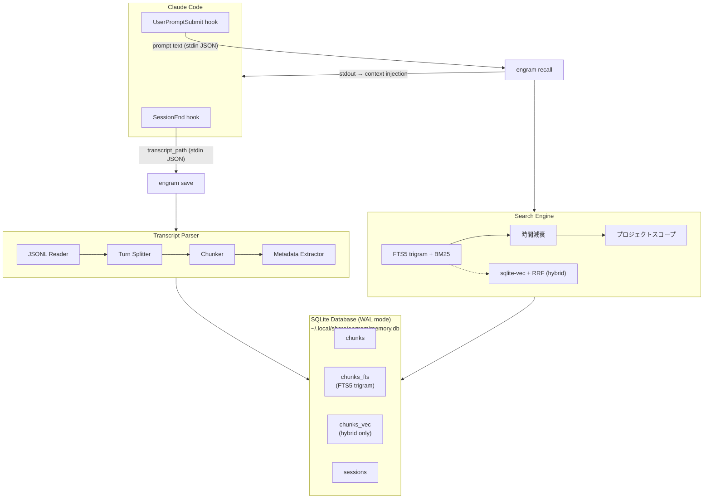

# Engram

Claude Codeのセッション会話を自動的に記録し、過去の議論や設計判断を検索できるようにするローカル長期記憶システムです。
[sui-memory](https://zenn.dev/noprogllama/articles/7c24b2c2410213)の設計思想を継承しつつ、TypeScriptで再実装しています。

## 特徴

- セッション終了時にトランスクリプトを自動で保存します
- プロンプト送信時に関連する過去の記憶を自動で注入します
- 外部APIやモデルのダウンロードは不要です
- SQLite単一ファイルに全データを格納します
- ランタイム依存はbetter-sqlite3のみです
- CLIから記憶の検索、編集、削除ができます

## 設計原則

| # | 原則 | 説明 |
| --- | --- | --- |
| 1 | 外部依存の排除 | SQLite単一ファイルに全データを格納します。外部APIや大規模モデルのダウンロードは不要です |
| 2 | 保存時トークン消費ゼロ | LLMを使わずにチャンク化します。ルールベースの処理のみで動作します |
| 3 | 自動保存 | SessionEnd hookにより手動操作なしで保存が行われます |
| 4 | 常時参照 | UserPromptSubmit hookにより毎メッセージ送信時に自動的に関連記憶を注入します |
| 5 | 編集と削除 | CLIから履歴の検索、編集、削除ができます |
| 6 | 最小依存 | ランタイム依存はbetter-sqlite3のみです。CLIにはnode:util.parseArgsを使用しています |

## sui-memoryからの主要改善点

| 領域 | sui-memory | Engram |
| --- | --- | --- |
| 言語 | Python 1,759行 | TypeScript |
| ランタイム依存 | sentence-transformers, sqlite-vec | better-sqlite3のみ(coreモード) |
| モデルダウンロード | Ruri v3-310m (約600MB) | 不要(FTS5 trigram検索がデフォルト) |
| チャンク分割 | Q&A形式ルールベース | ターンベース + サイズ適応 + メタデータ抽出 |
| 検索 | RRF (FTS5 + ベクトル) | FTS5 trigram + BM25 + 時間減衰 + プロジェクトスコープ |
| 記憶注入 | 明示的検索のみ | UserPromptSubmit hookで自動注入(常時参照) |
| セットアップ | `uv sync` | `pnpm install -g` + `engram setup`(hook自動設定) |
| 記憶管理 | なし | CLI経由で編集、削除、エクスポートが可能 |

## 検索モード

Engramには2つの検索モードがあります。デフォルトはcoreモードです。

| モード | 検索方式 | 追加依存 | モデルダウンロード | 精度 |
| --- | --- | --- | --- | --- |
| core(デフォルト) | FTS5 trigram + BM25 + 時間減衰 | なし | 不要 | 十分実用的 |
| hybrid(オプション) | FTS5 + ベクトル検索 + RRF | sqlite-vec, @huggingface/transformers | 約23MB (int8) | 最高 |

hybridモードを有効にするには `engram setup --hybrid` を実行します。

## 必要環境

- Node.js 20以上
- pnpm

## インストール

```bash
pnpm add -g engram-memory
```

## セットアップ

以下のコマンドを実行すると、データベースの初期化とClaude Codeのhook設定が自動で行われます。

```bash
engram setup
```

セットアップが完了すると、次のClaude Codeセッションから自動記録が始まります。

設定される内容は以下のとおりです。

- データベースが `~/.local/share/engram/memory.db` に作成されます
- Claude Codeの `~/.claude/settings.json` にhookが追加されます
  - SessionEnd hookでセッション終了時に会話を自動保存します
  - UserPromptSubmit hookでプロンプト送信時に関連記憶を自動注入します

hybridモードを有効にする場合は以下を実行します。

```bash
engram setup --hybrid
```

追加パッケージ(sqlite-vec, @huggingface/transformers)のインストールとembeddingモデルのダウンロードが行われます。

## 使い方

### メモリの検索

```bash
engram search "React Hook Form"
```

### セッション一覧の表示

```bash
engram list
engram list --all-projects
```

### 統計情報の表示

```bash
engram stats
```

### チャンクの編集

チャンクの内容を更新すると、FTS5トリガーによりインデックスが自動で再構築されます。
hybridモードではembeddingも再生成されます。

```bash
engram edit 42 --content "修正した内容"
```

### データの削除

セッション単位、日付指定、チャンク単位で削除できます。
削除するとFTS5トリガーにより検索インデックスも自動で同期されます。
セッション内の全チャンクが削除されると、セッション自体も削除されます。

```bash
engram delete --session abc123
engram delete --before 2024-01-01
engram delete --chunk 42
```

### 古いメモリの一括削除

```bash
engram prune --older-than 90d
```

### エクスポート

JSON形式またはMarkdown形式でエクスポートできます。

```bash
engram export --format json > backup.json
engram export --format markdown > backup.md
```

### claude-memからのインポート

[claude-mem](https://github.com/anthropics/claude-code/tree/main/packages/claude-mem)のデータベースからobservationsとsession summariesをインポートできます。

```bash
engram import-claude-mem
```

特定のプロジェクトだけをインポートすることもできます。

```bash
engram import-claude-mem --project my-project
```

インポート前に件数だけ確認したい場合は`--dry-run`を使います。

```bash
engram import-claude-mem --dry-run
```

claude-memのデータベースがデフォルトの `~/.claude-mem/claude-mem.db` 以外にある場合は`--source`で指定します。

```bash
engram import-claude-mem --source /path/to/claude-mem.db
```

既にインポート済みのセッションは自動でスキップされるため、繰り返し実行しても重複は発生しません。

### 共通オプション

すべてのコマンドで以下のオプションが使えます。

| オプション | 説明 |
| --- | --- |
| `--project <path>` | プロジェクトパスを指定します |
| `--all-projects` | 全プロジェクトを横断して検索します |
| `--config <path>` | 設定ファイルのパスを指定します |

## アーキテクチャ

Engramは2つのClaude Code hookで動作します。



### 保存の流れ

セッション終了時に、トランスクリプトのJSONLファイルを読み込み、ターン単位でチャンク分割します。
各チャンクからファイルパス、ツール名、エラーメッセージなどのメタデータを抽出し、SQLiteに保存します。

### 検索の流れ

プロンプト送信時に、入力テキストでFTS5 trigram検索を実行します。
検索結果にBM25スコアと時間減衰を適用し、関連度の高い過去の記憶をClaude Codeのコンテキストに注入します。

## データモデル

### SQLiteスキーマ

```sql
-- チャンクテーブル(会話の断片を格納します)
CREATE TABLE chunks (
  id INTEGER PRIMARY KEY AUTOINCREMENT,
  session_id TEXT NOT NULL,
  project_path TEXT NOT NULL,
  chunk_index INTEGER NOT NULL,
  content TEXT NOT NULL,
  role TEXT NOT NULL CHECK(role IN ('human', 'assistant', 'mixed')),
  metadata TEXT,  -- JSON: { filePaths, toolNames, errorMessages }
  created_at TEXT NOT NULL DEFAULT (datetime('now')),
  token_count INTEGER NOT NULL DEFAULT 0,
  UNIQUE(session_id, chunk_index)
);

CREATE INDEX idx_chunks_project ON chunks(project_path);
CREATE INDEX idx_chunks_created ON chunks(created_at DESC);
CREATE INDEX idx_chunks_session ON chunks(session_id);

-- FTS5全文検索(trigramトークナイザにより日本語対応、外部辞書不要)
CREATE VIRTUAL TABLE chunks_fts USING fts5(
  content,
  content=chunks,
  content_rowid=id,
  tokenize='trigram'
);

-- FTS5同期トリガー(INSERT/DELETE/UPDATEに自動連動します)
CREATE TRIGGER chunks_ai AFTER INSERT ON chunks BEGIN
  INSERT INTO chunks_fts(rowid, content) VALUES (new.id, new.content);
END;
CREATE TRIGGER chunks_ad AFTER DELETE ON chunks BEGIN
  INSERT INTO chunks_fts(chunks_fts, rowid, content)
    VALUES('delete', old.id, old.content);
END;
CREATE TRIGGER chunks_au AFTER UPDATE OF content ON chunks BEGIN
  INSERT INTO chunks_fts(chunks_fts, rowid, content)
    VALUES('delete', old.id, old.content);
  INSERT INTO chunks_fts(rowid, content) VALUES (new.id, new.content);
END;

-- セッションメタデータ
CREATE TABLE sessions (
  session_id TEXT PRIMARY KEY,
  project_path TEXT NOT NULL,
  started_at TEXT,
  ended_at TEXT NOT NULL DEFAULT (datetime('now')),
  chunk_count INTEGER DEFAULT 0,
  first_message TEXT,
  last_message TEXT
);

CREATE INDEX idx_sessions_project ON sessions(project_path);

-- スキーマバージョン管理
CREATE TABLE schema_version (
  version INTEGER PRIMARY KEY,
  applied_at TEXT NOT NULL DEFAULT (datetime('now'))
);

-- hybridモード用テーブル(engram setup --hybrid 実行時のみ作成されます)
CREATE VIRTUAL TABLE chunks_vec USING vec0(
  chunk_id INTEGER PRIMARY KEY,
  embedding float[384]  -- multilingual-e5-small
);
```

### FTS5 trigramトークナイザの選定理由

trigram方式は3文字単位でトークン化するため、日本語のような分かち書きのない言語でも外部辞書なしに機能します。

| 方式 | 日本語 | 固有名詞 | 部分一致 | 外部依存 |
| --- | --- | --- | --- | --- |
| unicode61 | 非対応 | 非対応 | 非対応 | なし |
| ICU | 対応 | 対応 | 非対応 | ICUライブラリ |
| trigram | 対応 | 対応 | 対応 | なし |

2文字以下のクエリではFTS5 trigramによる検索ができません(例: "JS"は検索できませんが、"JavaScript"は検索できます)。
2文字以下のクエリを受け取った場合は、自動的にLIKE検索にフォールバックします。

### チャンクデータ構造

```typescript
interface Chunk {
  sessionId: string;
  projectPath: string;
  chunkIndex: number;
  content: string;
  role: 'human' | 'assistant' | 'mixed';
  metadata: {
    filePaths: string[];
    toolNames: string[];
    errorMessages: string[];
  };
  createdAt: Date;
  tokenCount: number;
}
```

## コンポーネント詳細

### トランスクリプトパーサー

Claude Codeのトランスクリプトは以下のパスにJSONL形式で保存されます。

```text
~/.claude/projects/<project-hash>/sessions/<session-id>.jsonl
```

各行のJSON構造は以下のとおりです。

```json
{"type":"user","message":{"role":"user","content":[{"type":"text","text":"..."}]},"sessionId":"...","timestamp":"..."}

{"type":"assistant","message":{"role":"assistant","content":[
  {"type":"text","text":"..."},
  {"type":"tool_use","id":"...","name":"Bash","input":{"command":"..."}}
]},"sessionId":"..."}

{"type":"user","toolUseResult":{"type":"tool_result","tool_use_id":"...","content":"..."},"sessionId":"..."}

{"type":"summary","isCompactSummary":true,"summary":"...","sessionId":"..."}
```

### チャンク分割アルゴリズム

チャンク分割は以下の手順で行います。

1. JSONL行をパースして分類します。`isCompactSummary=true`の行は除外し、`toolUseResult`は直前のassistantメッセージに統合します
2. ターン(1往復)を構築します。各ターンはユーザーメッセージとアシスタントメッセージ+ツール結果のペアです
3. ターンをテキスト化します。ユーザーメッセージとアシスタントテキストはそのまま、ツール出力は先頭20行 + `...(truncated)` + 末尾5行に切り詰めます。ファイルパスやコマンド名はメタデータとして抽出します
4. トークン数(文字数/4で推定)が512以下なら1チャンクにし、超える場合は段落やコードブロックの境界で分割します
5. 正規表現でメタデータを抽出します。ファイルパス、ツール名、エラーメッセージを検出します

テキスト化後のフォーマット例は以下のとおりです。

```text
[User]
ReactのコンポーネントでuseStateを使ったフォーム管理を実装したい

[Assistant]
src/components/Form.tsxを作成しました。useStateで入力値を管理し、
バリデーション付きのフォームを実装しています。

[Tool: Edit] src/components/Form.tsx
[Tool: Bash] npm test -- --run → Tests: 3 passed
```

### 検索エンジン

coreモードではFTS5 trigram + BM25スコア + 時間減衰 + プロジェクトスコープで検索します。

検索に使用するSQLは以下のとおりです。

```sql
SELECT c.id, c.content, c.session_id, c.created_at, c.metadata,
       f.rank AS bm25_score
FROM chunks_fts f
JOIN chunks c ON c.id = f.rowid
WHERE chunks_fts MATCH ?
  AND c.project_path = ?
ORDER BY f.rank
LIMIT 20;
```

2文字以下のクエリには以下のフォールバックSQLを使います。

```sql
SELECT c.id, c.content, c.session_id, c.created_at, c.metadata
FROM chunks c
WHERE c.content LIKE ?
  AND c.project_path = ?
ORDER BY c.created_at DESC
LIMIT 20;
```

時間減衰は指数関数で計算します。半減期はデフォルトで30日です。

```typescript
function applyTimeDecay(
  results: { id: number; score: number; createdAt: string }[],
  halfLifeDays: number = 30
): typeof results {
  const now = Date.now();
  const lambda = Math.LN2 / (halfLifeDays * 86400000);

  return results
    .map(r => ({
      ...r,
      score: r.score * Math.exp(-lambda * (now - new Date(r.createdAt).getTime()))
    }))
    .sort((a, b) => b.score - a.score);
}
```

プロジェクトスコープはデフォルトで有効になっており、cwdと一致するproject_pathのチャンクのみを検索します。
`--all-projects`フラグを指定すると全プロジェクトを横断して検索できます。

同一セッションの隣接するチャンク(chunk_indexが連続)はグループ化され、最もスコアの高いチャンクが代表として返されます。

### hybridモード(オプション)

hybridモードではcoreの検索に加えて、ベクトル類似検索とRRF(Reciprocal Rank Fusion)統合を追加します。

```typescript
function reciprocalRankFusion(
  ftsResults: { id: number; rank: number }[],
  vecResults: { id: number; rank: number }[],
  k: number = 60
): Map<number, number> {
  const scores = new Map<number, number>();

  for (let i = 0; i < ftsResults.length; i++) {
    const id = ftsResults[i].id;
    scores.set(id, (scores.get(id) ?? 0) + 1 / (i + 1 + k));
  }
  for (let i = 0; i < vecResults.length; i++) {
    const id = vecResults[i].id;
    scores.set(id, (scores.get(id) ?? 0) + 1 / (i + 1 + k));
  }
  return scores;
}
```

k=60は原論文(Cormack et al., 2009)で最も安定していると報告された値です。

hybridモードで使用するembeddingモデルは以下のとおりです。

| 項目 | 値 |
| --- | --- |
| モデル | Xenova/multilingual-e5-small |
| 次元 | 384 |
| サイズ | 約23MB (int8 quantized) |
| 言語 | 100言語対応 |
| プレフィックス | query: `query:` / document: `passage:` |

### hook設定

`engram setup`を実行すると、以下のhook設定がClaude Codeの`settings.json`に追加されます。

SessionEnd hook(自動保存)の設定は以下のとおりです。

```json
{
  "hooks": {
    "SessionEnd": [
      {
        "hooks": [
          {
            "type": "command",
            "command": "engram save --stdin 2>> ~/.local/share/engram/error.log"
          }
        ]
      }
    ]
  }
}
```

SessionEnd hookの処理の流れは以下のとおりです。

1. stdinからJSONを読み取ります(`{ session_id, transcript_path, cwd }`)
2. JSONLファイルを読み込み、チャンク分割とメタデータ抽出を行います
3. hybridモードの場合はembeddingをバッチ生成します
4. SQLiteトランザクション内で一括INSERTします
5. exit 0で終了します

UserPromptSubmit hook(自動記憶注入)の設定は以下のとおりです。

```json
{
  "hooks": {
    "UserPromptSubmit": [
      {
        "hooks": [
          {
            "type": "command",
            "command": "engram recall --stdin --limit 3 --min-score 0.01"
          }
        ]
      }
    ]
  }
}
```

UserPromptSubmit hookの処理の流れは以下のとおりです。

1. stdinからJSONを読み取ります(`{ prompt, session_id, cwd }`)
2. promptで検索を実行します(cwdからproject_pathを推定)
3. 関連記憶が見つかればstdoutに出力します(Claude Codeのコンテキストに注入されます)
4. 見つからなければ何も出力せずexit 0で終了します

### 記憶注入の出力例

プロンプト送信時に関連する記憶が見つかると、以下のような形式でコンテキストに注入されます。

```text
[Past Memory] 関連する過去の会話:

---
[2024-01-15 abc123] (relevance: 0.42)
[User] ReactのフォームでuseStateとReact Hook Formどちらがいい？
[Assistant] 小規模ならuseState、複雑バリデーションならRHF。本プロジェクトではRHFを採用。
---
```

### レイテンシ

- FTS5検索はミリ秒オーダーで動作します(モデルのロードが不要)
- coreモードでは50ms以内に応答できます
- hybridモードでもモデルがキャッシュ済みなら200ms以内に応答できます

## 設定

設定ファイルは `~/.config/engram/config.json` に配置します。
すべての項目はオプションで、省略するとデフォルト値が使われます。

```json
{
  "database": {
    "path": "~/.local/share/engram/memory.db"
  },
  "search": {
    "mode": "core",
    "timeDecayHalfLifeDays": 30,
    "defaultLimit": 5,
    "projectScope": true
  },
  "chunking": {
    "maxTokensPerChunk": 512,
    "truncateToolOutputLines": 20,
    "truncateToolOutputTailLines": 5
  },
  "hooks": {
    "autoRecall": true,
    "recallLimit": 3,
    "minRelevanceScore": 0.01
  },
  "embedding": {
    "model": "Xenova/multilingual-e5-small",
    "quantized": true,
    "cacheDir": "~/.cache/engram/models"
  }
}
```

embeddingセクションはhybridモード専用です。

各設定項目の意味は以下のとおりです。

| セクション | キー | デフォルト | 説明 |
| --- | --- | --- | --- |
| database | path | `~/.local/share/engram/memory.db` | データベースファイルのパスです |
| search | mode | `core` | 検索モードを指定します(`core`または`hybrid`) |
| search | timeDecayHalfLifeDays | 30 | 時間減衰の半減期(日数)です |
| search | defaultLimit | 5 | 検索結果のデフォルト件数です |
| search | projectScope | true | プロジェクト単位で検索を絞り込みます |
| chunking | maxTokensPerChunk | 512 | チャンクあたりの最大トークン数です |
| chunking | truncateToolOutputLines | 20 | ツール出力の先頭保持行数です |
| chunking | truncateToolOutputTailLines | 5 | ツール出力の末尾保持行数です |
| hooks | autoRecall | true | プロンプト送信時の自動記憶注入を有効にします |
| hooks | recallLimit | 3 | 自動注入する記憶の最大件数です |
| hooks | minRelevanceScore | 0.01 | 注入する記憶の最低関連度スコアです |
| embedding | model | `Xenova/multilingual-e5-small` | hybridモードで使用するembeddingモデルです |
| embedding | quantized | true | int8量子化モデルを使用します |
| embedding | cacheDir | `~/.cache/engram/models` | モデルのキャッシュディレクトリです |

## 依存パッケージ

ランタイム依存は1個のみです。CLIには`node:util.parseArgs`、パスには`node:path`、ファイルIOには`node:fs/readline`を使用しています。

| パッケージ | サイズ | 用途 |
| --- | --- | --- |
| better-sqlite3 | 約2MB (native) | SQLiteバインディングです。FTS5を内蔵しています |
| sqlite-vec (hybridのみ) | 約500KB (native) | ベクトル検索拡張です |
| @huggingface/transformers (hybridのみ) | 約5MB + モデル約23MB | embedding生成に使用します |

hybridモードの追加パッケージは以下のコマンドでインストールします。

```bash
pnpm add sqlite-vec @huggingface/transformers
```

## ディレクトリ構成

```text
engram/
├── package.json
├── tsconfig.json
├── vite.config.ts
├── src/
│   ├── cli.ts                  # CLIエントリポイント
│   ├── config.ts               # 設定管理(XDGパス解決)
│   ├── db/
│   │   ├── connection.ts       # DB接続(WALモード)
│   │   ├── schema.ts           # スキーマとマイグレーション
│   │   └── store.ts            # データアクセス層
│   ├── parser/
│   │   ├── transcript.ts       # JSONLパーサー
│   │   ├── chunker.ts          # ターンベースチャンク分割
│   │   └── metadata.ts         # メタデータ抽出
│   ├── search/
│   │   ├── fts.ts              # FTS5 trigram + BM25
│   │   ├── hybrid.ts           # スコアリングと重複排除
│   │   └── formatter.ts        # 出力フォーマット
│   ├── import/
│   │   └── claude-mem.ts       # claude-memインポート
│   └── hooks/
│       ├── save.ts             # SessionEndハンドラ
│       ├── recall.ts           # UserPromptSubmitハンドラ
│       └── setup.ts            # hook自動設定
└── tests/
    ├── parser/
    ├── search/
    ├── hooks/
    ├── import/
    └── fixtures/
```

## 開発

### ビルド

```bash
pnpm build
```

### テスト

```bash
pnpm test
```

### 型チェック

```bash
pnpm typecheck
```

### リント

```bash
pnpm lint
```

### フォーマットチェック

```bash
pnpm format
```

### 全チェックの一括実行

```bash
pnpm check
```

## パフォーマンス目標

| 操作 | coreモード | hybridモード |
| --- | --- | --- |
| 検索(recall) | 50ms以内 | 200ms以内 |
| チャンク保存(100個) | 1秒以内 | 10秒以内 |
| セットアップ | 5秒以内 | 30秒以内(モデルダウンロード含む) |
| DBサイズ(1000チャンクあたり) | 約5MB | 約8MB(ベクトルデータ含む) |

## エッジケースとエラーハンドリング

| ケース | 対処 |
| --- | --- |
| 巨大トランスクリプト(10MB以上) | readlineによる行単位ストリーミングで処理します |
| 空のトランスクリプト | スキップします |
| compactionサマリー行 | isCompactSummaryフラグを検出して除外します |
| 2文字以下の検索クエリ | LIKE検索にフォールバックします |
| 並行アクセス | WALモードにより読み取りは並行で実行でき、書き込みはSQLiteがシリアル化します |
| hook内でのクラッシュ | stderrにエラーを出力し、exit 0で終了します(Claude Codeをブロックしません) |
| DB未初期化 | 初回実行時に自動で作成されます |
| 設定ファイル不在 | すべてデフォルト値で動作します |
| プロジェクトパス正規化 | realpathで正規化します |

## セキュリティとプライバシー

- すべてのデータはローカルに保存され、外部APIへの送信は行いません
- hybridモードのembedding生成もTransformers.jsによるローカル推論です
- `.env`ファイルの内容やシークレットパターンを検出してマスクします(パターン: `/(?:password|secret|token|api[_-]?key)\s*[=:]\s*\S+/i`)
- データベースファイルはパーミッション0600で作成されます
- hybridモードのモデルはHugging Face公式CDNからのみダウンロードされます

## 将来の拡張計画

以下は設計上考慮していますが、現時点では実装対象外です。

1. MCP Server化により、ツールとして明示的な検索を可能にします
2. Ruri v3に対応し、高精度な日本語embeddingモデルを利用できるようにします
3. cross-encoderによるリランキングを導入します
4. Web UIを実装し、ブラウザからメモリの管理を可能にします
5. 類似チャンクの自動統合により、重複メモリをマージします

## ライセンス

MIT
