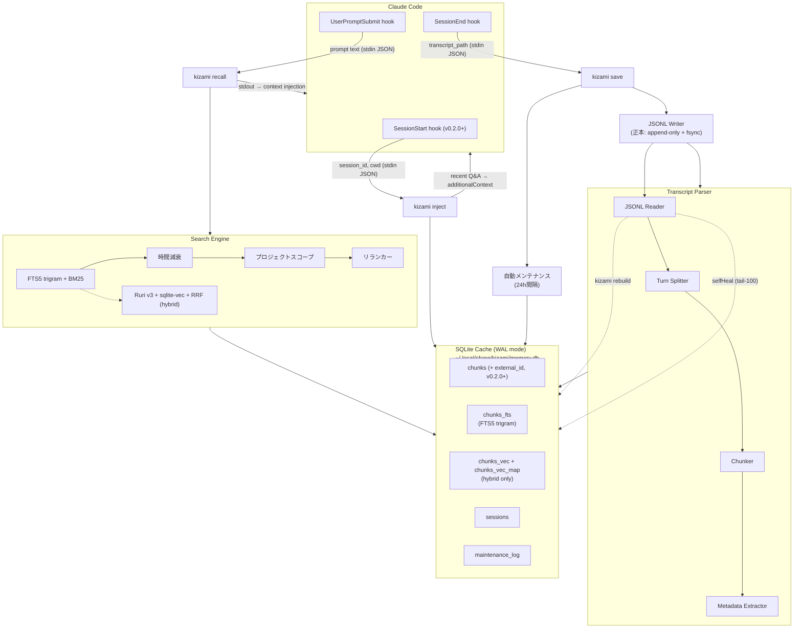

# Kizami

Claude Codeのセッション会話を自動的に記録し、過去の議論や設計判断を検索できるようにするローカル長期記憶システムです。
[sui-memory](https://zenn.dev/noprogllama/articles/7c24b2c2410213)の設計思想を継承しつつ、TypeScriptで再実装しています。

## 特徴

- **JSONL正本 + SQLiteキャッシュの二層構成 (v0.2.0〜)**: 月＋ホスト単位の append-only JSONL を正本とし、SQLite は派生キャッシュとして再生成可能です。Git同期・障害復旧・スキーマ実験に強い構成です
- **SessionStart hook で冒頭注入 (v0.2.0〜)**: セッション開始時に同プロジェクトの直近Q&Aを自動でコンテキスト先頭に注入します
- **HF_HUB_OFFLINEデフォルト化 (v0.2.0〜)**: hybridモードの埋め込み生成時に Hugging Face Hub への暗黙テレメトリ/ping を遮断します
- セッション終了時にトランスクリプトを自動で保存します
- プロンプト送信時に関連する過去の記憶を自動で注入します
- 外部APIやモデルのダウンロードは不要です(coreモード)
- hybridモードではRuri v3日本語embeddingによるベクトル検索も利用できます
- DB肥大化を防ぐ自動メンテナンス機能を内蔵しています(90日超の古いチャンク削除、サイズ上限制御)
- CLIから記憶の検索、編集、削除ができます

## 設計原則

| #   | 原則                   | 説明                                                                                                           |
| --- | ---------------------- | -------------------------------------------------------------------------------------------------------------- |
| 1   | 外部依存の排除         | SQLite単一ファイルに全データを格納します。外部APIや大規模モデルのダウンロードは不要です                        |
| 2   | 保存時トークン消費ゼロ | LLMを使わずにチャンク化します。ルールベースの処理のみで動作します                                              |
| 3   | 自動保存               | SessionEnd hookにより手動操作なしで保存が行われます                                                            |
| 4   | 常時参照               | UserPromptSubmit hookにより毎メッセージ送信時に自動的に関連記憶を注入します                                    |
| 5   | 編集と削除             | CLIから履歴の検索、編集、削除ができます                                                                        |
| 6   | 最小依存               | coreモードのランタイム依存はbetter-sqlite3のみです。CLIにはnode:util.parseArgsを使用しています                 |
| 7   | DB肥大化対策           | セッション保存時に自動メンテナンスが実行されます。古いチャンクの削除とDBサイズ制限を24時間ごとにチェックします |

## 類似ツールとの比較

| 領域               | sui-memory                        | claude-mem                    | Kizami                                            |
| ------------------ | --------------------------------- | ----------------------------- | ------------------------------------------------- |
| 言語               | Python                            | Bun/Python/JS                 | TypeScript                                        |
| ランタイム依存     | sentence-transformers, sqlite-vec | Chroma, Claude Agent SDK等    | better-sqlite3のみ(coreモード)                    |
| モデルダウンロード | Ruri v3-310m (約600MB)            | 内部embedding                 | coreでは不要。hybridではRuri v3-30m (約37MB)      |
| チャンク分割       | Q&A形式ルールベース               | AI圧縮(APIトークン消費あり)   | ルールベース(トークン消費ゼロ)                    |
| データモデル       | Q&Aペア                           | observation + session summary | ターンベースチャンク + メタデータ                 |
| 検索               | RRF (FTS5 + ベクトル)             | FTS5 + Chroma + 3層段階開示   | FTS5 + BM25 + 時間減衰 + リランカー(+ RRF hybrid) |
| 記憶注入           | 明示的検索のみ                    | MCP Server経由で明示的検索    | UserPromptSubmit hookで自動注入(常時参照)         |
| セットアップ       | `uv sync`                         | npm install -g                | `npm link` + `kizami setup`                       |
| Web UI             | なし                              | localhost:37777で可視化       | なし                                              |
| 記憶管理           | なし                              | Web UI経由                    | CLI経由で編集、削除、エクスポート、マージ         |
| DB肥大化対策       | なし                              | AI圧縮による暗黙的な削減      | 自動メンテナンス(90日超削除、サイズ上限制御)      |
| プライバシータグ   | なし                              | `<private>`タグで除外可能     | なし                                              |
| observation分類    | なし                              | bugfix, feature等を自動分類   | なし                                              |

### Kizamiにあってclaude-memにない機能

- プロンプト送信時の自動記憶注入(hookベースの常時参照)
- 時間減衰による新しい記憶の優先
- 保存時のトークン消費ゼロ(ルールベースのチャンク分割)
- 日本語特化embedding(Ruri v3)によるhybrid検索
- CLI経由での記憶の直接編集、削除、エクスポート
- 自動メンテナンスによるDB肥大化防止
- 類似チャンクの検出とマージ

### claude-memにあってKizamiにない機能

- AI圧縮によるセッション要約の自動生成(observation + summary形式)
- Web UIによるリアルタイムメモリストリーム可視化
- `<private>`タグによる機密データの除外
- observationの自動分類(bugfix, feature, discovery等)
- MCP Serverとしての動作(MCPツール経由での検索)
- Chroma専用ベクトルDBによるセマンティック検索
- 3層段階開示パターンによるトークン効率化

## 検索モード

Kizamiには2つの検索モードがあります。デフォルトはcoreモードです。

| モード             | 検索方式                         | 追加依存                              | モデルダウンロード | 精度       |
| ------------------ | -------------------------------- | ------------------------------------- | ------------------ | ---------- |
| core(デフォルト)   | FTS5 trigram + BM25 + 時間減衰   | なし                                  | 不要               | 十分実用的 |
| hybrid(オプション) | FTS5 + Ruri v3ベクトル検索 + RRF | sqlite-vec, @huggingface/transformers | 約37MB (int8)      | 最高       |

hybridモードを有効にするには `kizami setup --hybrid` を実行します。

## 必要環境

- Node.js 24以上（`package.json` の `engines.node` で `24.13.0` を指定。`engineStrict: true` のため一致するバージョンを使うこと）
- pnpm 11以上

## インストール

リポジトリをクローンしてビルドし、グローバルにリンクします。

```bash
git clone https://github.com/okamyuji/kizami.git
cd kizami
pnpm install --frozen-lockfile
pnpm build
npm link
```

これで`kizami`コマンドがPATHに追加されます。ビルドスクリプトが`dist/cli.js`に実行権限を自動付与します。miseやnvm等のバージョン管理ツールを使っている場合は、リンク後に`mise reshim`等でshimを更新してください。

## セットアップ

以下のコマンドを実行すると、データベースの初期化とClaude Codeのhook設定が自動で行われます。

```bash
kizami setup
```

セットアップが完了すると、次のClaude Codeセッションから自動記録が始まります。

設定される内容は以下のとおりです。

- データベースが `~/.local/share/kizami/memory.db` に作成されます (キャッシュ層)
- **JSONL正本ディレクトリが `~/.local/share/kizami/jsonl/` に作成されます (v0.2.0〜)**
- 設定ファイルが `~/.config/kizami/config.json` に作成されます
- Claude Codeの `~/.claude/settings.json` にhookが追加されます
  - **SessionStart hook でセッション開始時にプロジェクト直近Q&Aを冒頭注入します (v0.2.0〜)**
  - SessionEnd hookでセッション終了時に会話を自動保存します
  - UserPromptSubmit hookでプロンプト送信時に関連記憶を自動注入します

### v0.1.1 / v0.1.2 からのアップグレード

JSONL正本化のため、v0.1.1 または v0.1.2 から v0.2.0 に上げる既存ユーザーは初回起動時に以下のコマンドでマイグレーションを実行してください。

```bash
kizami migrate-to-jsonl
```

これにより既存のSQLiteチャンクが JSONL に書き出され、外部ID (`external_id` = UUID) が SQLite側にも書き戻されます。**データロスは発生しません**。未実行のまま使用してもデータロスはありませんが、自動復旧/Git同期が無効化されます。`kizami setup` 実行時に未移行を検知すると案内が表示されます。

hybridモードを有効にする場合は以下を実行します。

```bash
kizami setup --hybrid
```

hybridモードでは追加パッケージ(sqlite-vec, @huggingface/transformers)が必要です。事前にインストールしてください。

```bash
pnpm add sqlite-vec @huggingface/transformers
pnpm build
npm link
```

初回のsave時にRuri v3 embeddingモデル(約37MB, int8)が自動でダウンロードされます。

coreモードからhybridモードに切り替えた場合、既存チャンクにはembeddingがありません。以下のコマンドで一括生成できます。

```bash
kizami embed --backfill
```

`kizami setup --hybrid`の実行時にembeddingのないチャンクが検出されると、このコマンドの実行を促すメッセージが表示されます。

## 使い方

### メモリの検索

```bash
kizami search "React Hook Form"
```

### セッション一覧の表示

```bash
kizami list
kizami list --all-projects
```

### 統計情報の表示

```bash
kizami stats
```

### チャンクの編集

チャンクの内容を更新すると、FTS5トリガーによりインデックスが自動で再構築されます。
hybridモードではembeddingも再生成されます。

```bash
kizami edit 42 --content "修正した内容"
```

### データの削除

セッション単位、日付指定、チャンク単位で削除できます。
削除するとFTS5トリガーにより検索インデックスも自動で同期されます。
セッション内の全チャンクが削除されると、セッション自体も削除されます。

```bash
kizami delete --session abc123
kizami delete --before 2024-01-01
kizami delete --chunk 42
```

### 古いメモリの一括削除

```bash
kizami prune --older-than 90d
```

### エクスポート

JSON形式またはMarkdown形式でエクスポートできます。

```bash
kizami export --format json > backup.json
kizami export --format markdown > backup.md
```

### SQLiteキャッシュの再構築 (v0.2.0〜)

JSONL正本を信頼の源として SQLite キャッシュを完全再構築します。スキーマ変更時や DB 破損時の復旧に使えます。

```bash
kizami rebuild            # 全月を対象に再構築
kizami rebuild --dry-run  # 件数だけ確認 (SQLiteは触らない)
kizami rebuild --from-month 2026-05  # 特定月のみ
```

embedding が JSONL にインライン保存されている場合、モデルロード不要で復元されます (1000チャンクで実測 約55ms)。

### SQLite→JSONLマイグレーション (v0.1.1/v0.1.2 → v0.2.0)

```bash
kizami migrate-to-jsonl
```

既存のSQLiteチャンクをJSONLに書き出し、`external_id` (UUID) を両側に付与します。冪等です。

### claude-memからのインポート

[claude-mem](https://github.com/anthropics/claude-code/tree/main/packages/claude-mem)のデータベースからobservationsとsession summariesをインポートできます。

```bash
kizami import-claude-mem
```

特定のプロジェクトだけをインポートすることもできます。

```bash
kizami import-claude-mem --project my-project
```

インポート前に件数だけ確認したい場合は`--dry-run`を使います。

```bash
kizami import-claude-mem --dry-run
```

claude-memのデータベースがデフォルトの `~/.claude-mem/claude-mem.db` 以外にある場合は`--source`で指定します。

```bash
kizami import-claude-mem --source /path/to/claude-mem.db
```

既にインポート済みのセッションは自動でスキップされるため、繰り返し実行しても重複は発生しません。

### 類似チャンクのマージ

trigram Jaccard類似度を使って重複するチャンクを検出し、情報量の多い方を残してマージします。

```bash
kizami merge --all-projects
```

マージ前に検出結果だけ確認したい場合は`--dry-run`を使います。

```bash
kizami merge --dry-run --all-projects
```

類似度の閾値はデフォルトで0.6です。`--threshold`で変更できます。

```bash
kizami merge --threshold 0.7 --all-projects
```

### embeddingの一括生成

coreモードからhybridモードに切り替えた際、既存チャンクのembeddingを一括生成します。

```bash
kizami embed --backfill
```

生成前に件数だけ確認したい場合は`--dry-run`を使います。

```bash
kizami embed --backfill --dry-run
```

新規チャンクのembeddingはsave時に自動生成されるため、通常はこのコマンドを実行する必要はありません。

### 共通オプション

すべてのコマンドで以下のオプションが使えます。

| オプション         | 説明                               |
| ------------------ | ---------------------------------- |
| `--project <path>` | プロジェクトパスを指定します       |
| `--all-projects`   | 全プロジェクトを横断して検索します |
| `--config <path>`  | 設定ファイルのパスを指定します     |

## アーキテクチャ

Kizamiは3つのClaude Code hook(v0.2.0〜)で動作し、**JSONLを正本・SQLiteを派生キャッシュ**として二層管理します。



### 二層構成の責務分離 (v0.2.0〜)

| 層           | 役割                                 | 特性                                                 |
| ------------ | ------------------------------------ | ---------------------------------------------------- |
| JSONL (正本) | save時の真実の記録                   | append-only, fsync, Git同期可, テキストdiff親和性    |
| SQLite       | 検索/recall/inject用の派生キャッシュ | いつでも `kizami rebuild` で再生成可能（モデル不要） |

**フェイルファスト**: JSONL書き込みが失敗した場合は SQLite を一切触らずに例外伝播します。逆に SQLite 挿入だけが失敗した場合は、次回 save 時の self-heal が JSONL末尾100行と SQLite の差分を補完します。これにより「SQLiteにあるが JSONL にない」状態は構造的に発生しません。

### 保存の流れ (v0.2.0)

セッション終了時に、トランスクリプトのJSONLファイルを読み込み、ターン単位でチャンク分割します。
各チャンクからファイルパス、ツール名、エラーメッセージなどのメタデータを抽出します。
hybridモードではこの段階でRuri v3 embedding を生成します。

**正本である JSONL に先書き** (`crypto.randomUUID()` で `external_id` を付与, embedding は hex inline) します。fsync で耐クラッシュ性を担保し、失敗時は SQLite を触らずに例外伝播します。
その後 SQLite キャッシュへ挿入し、hybridモードならベクトルテーブルにも反映します。
保存完了後、self-heal(JSONL末尾100行 vs SQLite) と自動メンテナンス(24時間間隔)が実行されます。

### 検索の流れ

プロンプト送信時に、入力テキストからキーワードを抽出してFTS5 trigram検索を実行します。
検索結果にBM25スコアと時間減衰を適用し、セッション単位で重複排除した後、リランカーがクエリとの関連度を再スコアリングします。
hybridモードではベクトル検索結果とRRFで統合します。
関連度の高い過去の記憶をClaude Codeのコンテキストに注入します。

#### tieredモード(クロスプロジェクト検索)

`projectScope: "tiered"` を設定すると、現プロジェクトの検索結果を優先しつつ、他プロジェクトの関連記憶もフォールバックで取得します。
クロスプロジェクトの結果には `crossProjectPenalty`(デフォルト0.3)のスコア倍率が適用されるため、本当に関連度の高いものだけが表示されます。
出力には `[from: ProjectName]` タグが付与され、どのプロジェクトの記憶かを識別できます。

```json
{
  "search": {
    "projectScope": "tiered",
    "crossProjectPenalty": 0.3
  }
}
```

#### 段階的パラメータ緩和

`minRelevanceScore`が0(デフォルト)の場合、recallLimit(デフォルト3件)に満たないとき以下の順序でパラメータを自動緩和します。

1. **crossProjectPenalty緩和**(tieredモードのみ): ペナルティを3倍に引き上げ(0.3→0.9)、クロスプロジェクト結果をより多く許容します
2. **時間減衰緩和**: 半減期を3倍に延長(30日→90日)し、古いメモリも拾いやすくします
3. **minRelevanceScore緩和**: スコア閾値を0に下げ、低関連度の結果も返します

各フェーズは前のフェーズで目標件数に達しなかった場合にのみ実行されます。

`minRelevanceScore`が0より大きい場合、フォールバックカスケードは無効になります。閾値を下回る結果は注入されず、該当する記憶がなければ0件を返します。これにより低関連度のノイズ注入を防止できます。

## データモデル

### SQLiteスキーマ

```sql
-- チャンクテーブル(会話の断片を格納します)
CREATE TABLE chunks (
  id INTEGER PRIMARY KEY AUTOINCREMENT,
  external_id TEXT,  -- v0.2.0: JSONL正本との紐付け用 UUID (NULLABLEだが UNIQUE 部分インデックスあり)
  session_id TEXT NOT NULL,
  project_path TEXT NOT NULL,
  chunk_index INTEGER NOT NULL,
  content TEXT NOT NULL,
  role TEXT NOT NULL CHECK(role IN ('human', 'assistant', 'mixed')),
  metadata TEXT,  -- JSON: { filePaths, toolNames, errorMessages }
  created_at TEXT NOT NULL DEFAULT (datetime('now')),
  token_count INTEGER NOT NULL DEFAULT 0,
  UNIQUE(session_id, chunk_index)
);

CREATE INDEX idx_chunks_project ON chunks(project_path);
CREATE INDEX idx_chunks_created ON chunks(created_at DESC);
CREATE INDEX idx_chunks_session ON chunks(session_id);
CREATE UNIQUE INDEX idx_chunks_external_id ON chunks(external_id) WHERE external_id IS NOT NULL;

-- FTS5全文検索(trigramトークナイザにより日本語対応、外部辞書不要)
CREATE VIRTUAL TABLE chunks_fts USING fts5(
  content,
  content=chunks,
  content_rowid=id,
  tokenize='trigram'
);

-- FTS5同期トリガー(INSERT/DELETE/UPDATEに自動連動します)
CREATE TRIGGER chunks_ai AFTER INSERT ON chunks BEGIN
  INSERT INTO chunks_fts(rowid, content) VALUES (new.id, new.content);
END;
CREATE TRIGGER chunks_ad AFTER DELETE ON chunks BEGIN
  INSERT INTO chunks_fts(chunks_fts, rowid, content)
    VALUES('delete', old.id, old.content);
END;
CREATE TRIGGER chunks_au AFTER UPDATE OF content ON chunks BEGIN
  INSERT INTO chunks_fts(chunks_fts, rowid, content)
    VALUES('delete', old.id, old.content);
  INSERT INTO chunks_fts(rowid, content) VALUES (new.id, new.content);
END;

-- セッションメタデータ
CREATE TABLE sessions (
  session_id TEXT PRIMARY KEY,
  project_path TEXT NOT NULL,
  started_at TEXT,
  ended_at TEXT NOT NULL DEFAULT (datetime('now')),
  chunk_count INTEGER DEFAULT 0,
  first_message TEXT,
  last_message TEXT
);

CREATE INDEX idx_sessions_project ON sessions(project_path);

-- スキーマバージョン管理
CREATE TABLE schema_version (
  version INTEGER PRIMARY KEY,
  applied_at TEXT NOT NULL DEFAULT (datetime('now'))
);

-- 自動メンテナンスログ
CREATE TABLE maintenance_log (
  id INTEGER PRIMARY KEY AUTOINCREMENT,
  action TEXT NOT NULL,
  chunks_deleted INTEGER NOT NULL DEFAULT 0,
  bytes_freed INTEGER NOT NULL DEFAULT 0,
  executed_at TEXT NOT NULL DEFAULT (datetime('now'))
);

-- hybridモード用テーブル(kizami setup --hybrid 実行時のみ作成されます)
CREATE VIRTUAL TABLE IF NOT EXISTS chunks_vec USING vec0(embedding float[256]);

-- ベクトルとチャンクの対応テーブル
CREATE TABLE IF NOT EXISTS chunks_vec_map (
  chunk_id INTEGER PRIMARY KEY,
  vec_rowid INTEGER NOT NULL
);
```

### FTS5 trigramトークナイザの選定理由

trigram方式は3文字単位でトークン化するため、日本語のような分かち書きのない言語でも外部辞書なしに機能します。

| 方式      | 日本語 | 固有名詞 | 部分一致 | 外部依存      |
| --------- | ------ | -------- | -------- | ------------- |
| unicode61 | 非対応 | 非対応   | 非対応   | なし          |
| ICU       | 対応   | 対応     | 非対応   | ICUライブラリ |
| trigram   | 対応   | 対応     | 対応     | なし          |

2文字以下のクエリではFTS5 trigramによる検索ができません(例: "JS"は検索できませんが、"JavaScript"は検索できます)。
2文字以下のクエリを受け取った場合は、自動的にLIKE検索にフォールバックします。

### チャンクデータ構造

```typescript
interface Chunk {
  externalId?: string; // v0.2.0: JSONL正本との紐付け用 UUID
  sessionId: string;
  projectPath: string;
  chunkIndex: number;
  content: string;
  role: 'human' | 'assistant' | 'mixed';
  metadata: {
    filePaths: string[];
    toolNames: string[];
    errorMessages: string[];
  };
  createdAt: Date;
  tokenCount: number;
}
```

### JSONL正本のレコード構造 (v0.2.0〜)

`~/.local/share/kizami/jsonl/{YYYY}-{MM}-{hostname}.jsonl` の各行は以下のスキーマで append-only に追記されます。

```typescript
interface JsonlChunkRecord {
  v: 1; // schema version
  type: 'chunk';
  id: string; // crypto.randomUUID()
  sessionId: string;
  projectPath: string;
  chunkIndex: number;
  content: string;
  role: 'human' | 'assistant' | 'mixed';
  metadata: string | null; // JSON文字列
  tokenCount: number;
  createdAt: string; // ISO8601
  embedding?: string; // hex-encoded float32 (hybridモード時のみ)
  embeddingDim?: number;
  embeddingModel?: string;
}
```

## コンポーネント詳細

### トランスクリプトパーサー

Claude Codeのトランスクリプトは以下のパスにJSONL形式で保存されます。

```text
~/.claude/projects/<project-hash>/sessions/<session-id>.jsonl
```

各行のJSON構造は以下のとおりです。

```json
{"type":"user","message":{"role":"user","content":[{"type":"text","text":"..."}]},"sessionId":"...","timestamp":"..."}

{"type":"assistant","message":{"role":"assistant","content":[
  {"type":"text","text":"..."},
  {"type":"tool_use","id":"...","name":"Bash","input":{"command":"..."}}
]},"sessionId":"..."}

{"type":"user","toolUseResult":{"type":"tool_result","tool_use_id":"...","content":"..."},"sessionId":"..."}

{"type":"summary","isCompactSummary":true,"summary":"...","sessionId":"..."}
```

### チャンク分割アルゴリズム

チャンク分割は以下の手順で行います。

1. JSONL行をパースして分類します。`isCompactSummary=true`の行は除外し、`toolUseResult`は直前のassistantメッセージに統合します
2. ターン(1往復)を構築します。各ターンはユーザーメッセージとアシスタントメッセージ+ツール結果のペアです
3. ターンをテキスト化します。ユーザーメッセージとアシスタントテキストはそのまま、ツール出力は先頭20行 + `...(truncated)` + 末尾5行に切り詰めます。ファイルパスやコマンド名はメタデータとして抽出します
4. トークン数(文字数/4で推定)が512以下なら1チャンクにし、超える場合は段落やコードブロックの境界で分割します
5. 正規表現でメタデータを抽出します。ファイルパス、ツール名、エラーメッセージを検出します

テキスト化後のフォーマット例は以下のとおりです。

```text
[User]
ReactのコンポーネントでuseStateを使ったフォーム管理を実装したい

[Assistant]
src/components/Form.tsxを作成しました。useStateで入力値を管理し、
バリデーション付きのフォームを実装しています。

[Tool: Edit] src/components/Form.tsx
[Tool: Bash] npm test -- --run → Tests: 3 passed
```

### 検索エンジン

coreモードではFTS5 trigram + BM25スコア + 時間減衰 + プロジェクトスコープで検索します。

検索に使用するSQLは以下のとおりです。

```sql
SELECT c.id, c.content, c.session_id AS sessionId, c.created_at AS createdAt,
       c.metadata, rank
FROM chunks_fts f
JOIN chunks c ON c.id = f.rowid
WHERE chunks_fts MATCH ?
  AND c.project_path = ?
ORDER BY f.rank
LIMIT ?;
```

2文字以下のクエリには以下のフォールバックSQLを使います。

```sql
SELECT c.id, c.content, c.session_id AS sessionId, c.created_at AS createdAt,
       c.metadata
FROM chunks c
WHERE c.content LIKE '%' || ? || '%'
  AND c.project_path = ?
ORDER BY c.created_at DESC
LIMIT ?;
```

時間減衰は指数関数で計算します。半減期はデフォルトで30日です。

```typescript
function applyTimeDecay(
  results: { id: number; score: number; createdAt: string }[],
  halfLifeDays: number = 30
): typeof results {
  const now = Date.now();
  const lambda = Math.LN2 / (halfLifeDays * 86400000);

  return results
    .map((r) => ({
      ...r,
      score: r.score * Math.exp(-lambda * (now - new Date(r.createdAt).getTime())),
    }))
    .sort((a, b) => b.score - a.score);
}
```

プロジェクトスコープはデフォルトで有効になっており、cwdと一致するproject_pathのチャンクのみを検索します。
`--all-projects`フラグを指定すると全プロジェクトを横断して検索できます。

同一セッションの隣接するチャンク(chunk_indexが連続)はグループ化され、最もスコアの高いチャンクが代表として返されます。

### リランカー

FTS5のBM25スコアだけでなく、クエリとドキュメントの関連度をスコアリングするリランカーが検索パイプラインに組み込まれています。
リランカーは以下の要素を加重平均して関連度スコアを算出します。

- キーワードカバレッジ(クエリキーワードがドキュメントに何割含まれているか)
- キーワード密度(ドキュメント長に対するキーワード出現頻度)
- 近接ボーナス(キーワード同士が近くに出現する場合の加点)
- フレーズボーナス(クエリのサブフレーズがそのまま出現する場合の加点)

日本語テキストに対してはN-gramによるサブトークン分割を行い、分かち書きなしでもキーワードマッチングが機能します。

### hybridモード(オプション)

hybridモードではcoreの検索に加えて、ベクトル類似検索とRRF(Reciprocal Rank Fusion)統合を追加します。

```typescript
function reciprocalRankFusion(
  ftsResults: SearchResult[],
  vecResults: SearchResult[],
  k: number = 60
): SearchResult[] {
  const scores = new Map<number, { result: SearchResult; score: number }>();

  for (let i = 0; i < ftsResults.length; i++) {
    const r = ftsResults[i];
    const rrfScore = 1 / (i + 1 + k);
    const existing = scores.get(r.id);
    if (existing) existing.score += rrfScore;
    else scores.set(r.id, { result: r, score: rrfScore });
  }
  for (let i = 0; i < vecResults.length; i++) {
    const r = vecResults[i];
    const rrfScore = 1 / (i + 1 + k);
    const existing = scores.get(r.id);
    if (existing) existing.score += rrfScore;
    else scores.set(r.id, { result: r, score: rrfScore });
  }

  return [...scores.values()]
    .sort((a, b) => b.score - a.score)
    .map((entry) => ({ ...entry.result, rank: -entry.score }));
}
```

k=60は原論文(Cormack et al., 2009)で最も安定していると報告された値です。

hybridモードで使用するembeddingモデルは以下のとおりです。

| 項目           | 値                                                            |
| -------------- | ------------------------------------------------------------- |
| モデル         | sirasagi62/ruri-v3-30m-ONNX (cl-nagoya/ruri-v3-30mのONNX変換) |
| 次元           | 256                                                           |
| サイズ         | 約37MB (int8 quantized)                                       |
| 言語           | 日本語特化                                                    |
| プレフィックス | query: `検索クエリ:` / document: `検索文書:`                  |

### hook設定

`kizami setup`を実行すると、3つのhook設定がClaude Codeの`settings.json`に追加されます (v0.2.0〜)。

SessionStart hook(冒頭注入)の設定は以下のとおりです (v0.2.0〜)。

```json
{
  "hooks": {
    "SessionStart": [
      {
        "hooks": [
          {
            "type": "command",
            "command": "kizami inject --stdin"
          }
        ]
      }
    ]
  }
}
```

SessionStart hookの処理の流れは以下のとおりです。

1. stdinから `{ hook_event_name, session_id, cwd }` を読み取ります（Claude Code v2.1.0+で利用可能）
2. `cwd` を正規化して同プロジェクトの直近 `injectRecentCount` 件 (既定3件) を `created_at DESC` で取得します
3. 関連記憶があれば stdout に出力します。FTS/ベクトル検索を経由せず、`idx_chunks_created` を直接利用するため 50ms以内で応答します

SessionEnd hook(自動保存)の設定は以下のとおりです。

```json
{
  "hooks": {
    "SessionEnd": [
      {
        "hooks": [
          {
            "type": "command",
            "command": "kizami save --stdin 2>> ~/.local/share/kizami/error.log"
          }
        ]
      }
    ]
  }
}
```

SessionEnd hookの処理の流れは以下のとおりです (v0.2.0更新)。

1. stdinからJSONを読み取ります(`{ session_id, transcript_path, cwd }`)
2. JSONLファイルを読み込み、チャンク分割とメタデータ抽出を行います
3. hybridモードの場合はRuri v3でembedding(int8 q8量子化)を生成します
4. **正本である JSONL に先書きします**（append-only + fsync, embedding は hex でインライン保存）。失敗時は SQLite を触らずに例外伝播します
5. SQLite キャッシュへ挿入し、hybridモードならベクトルテーブルにも反映します
6. self-heal(JSONL末尾100行 vs SQLite差分補完)を実行します
7. 自動メンテナンスを実行します(前回から24時間以上経過している場合のみ)
8. exit 0で終了します

UserPromptSubmit hook(自動記憶注入)の設定は以下のとおりです。

```json
{
  "hooks": {
    "UserPromptSubmit": [
      {
        "hooks": [
          {
            "type": "command",
            "command": "kizami recall --stdin"
          }
        ]
      }
    ]
  }
}
```

注入件数や関連度閾値はCLIフラグではなく `~/.config/kizami/config.json` の `hooks` セクションで設定します(`recallLimit`、`minRelevanceScore`)。

UserPromptSubmit hookの処理の流れは以下のとおりです。

1. stdinからJSONを読み取ります(`{ prompt, session_id, cwd }`)
2. promptで検索を実行します(cwdからproject_pathを推定)
3. 関連記憶が見つかればstdoutに出力します(Claude Codeのコンテキストに注入されます)
4. 見つからなければ何も出力せずexit 0で終了します

### 記憶注入の出力例

プロンプト送信時に関連する記憶が見つかると、以下のような形式でコンテキストに注入されます。

```text
[Past Memory] 関連する過去の会話:

---
[2024-01-15 abc123] (relevance: 0.42)
[User] ReactのフォームでuseStateとReact Hook Formどちらがいい？
[Assistant] 小規模ならuseState、複雑バリデーションならRHF。本プロジェクトではRHFを採用。
---
```

### Token節約効果

Kizamiは全履歴をコンテキストに入れるのではなく、関連度の高いチャンクだけを注入するため、大幅なToken節約になります。以下は80セッション / 5,400チャンクが蓄積された実環境での計測結果です。

| 指標                     | 値                                  |
| ------------------------ | ----------------------------------- |
| DB内の総トークン数       | 1,676,514                           |
| recall 1回あたりの注入量 | 最大375トークン (3件 x 125トークン) |
| Token節約率              | 99.98%                              |

1セッションで50回プロンプトを送信した場合の比較は以下のとおりです。

| 方式               | トークン消費 |
| ------------------ | ------------ |
| 全履歴を毎回注入   | 83,825,700   |
| Kizamiのrecall注入 | 18,750       |
| 節約量             | 83,806,950   |

全履歴を渡す方式ではコンテキストウィンドウに収まらないため現実的ではありません。Kizamiは関連度スコアによるフィルタリングで必要な記憶だけを375トークン以内に収めて注入します。

### レイテンシ

- FTS5検索はミリ秒オーダーで動作します(モデルのロードが不要)
- coreモードでは50ms以内に応答できます
- hybridモードでもモデルがキャッシュ済みなら200ms以内に応答できます

## 設定

設定ファイルは `~/.config/kizami/config.json` に配置します(`$XDG_CONFIG_HOME`が設定されている場合はそのパスが使われます)。
すべての項目はオプションで、省略するとデフォルト値が使われます。`kizami setup`を実行すると検索モードのみを含む最小限の設定ファイルが自動生成されます。

```json
{
  "database": {
    "path": "/Users/you/.local/share/kizami/memory.db"
  },
  "storage": {
    "jsonlDir": "/Users/you/.local/share/kizami/jsonl",
    "selfHealTailLines": 100
  },
  "search": {
    "mode": "core",
    "timeDecayHalfLifeDays": 30,
    "defaultLimit": 5,
    "projectScope": true,
    "crossProjectPenalty": 0.3
  },
  "chunking": {
    "maxTokensPerChunk": 512,
    "truncateToolOutputLines": 20,
    "truncateToolOutputTailLines": 5
  },
  "hooks": {
    "autoRecall": true,
    "recallLimit": 3,
    "minRelevanceScore": 0,
    "injectRecentCount": 3
  },
  "maintenance": {
    "enabled": true,
    "intervalHours": 24,
    "maxChunkAgeDays": 90,
    "maxDbSizeMB": 100
  },
  "embedding": {
    "model": "sirasagi62/ruri-v3-30m-ONNX",
    "quantized": true,
    "dimensions": 256,
    "cacheDir": "/Users/you/.cache/kizami/models"
  }
}
```

maintenanceセクションは自動メンテナンスの設定です。embeddingセクションはhybridモード専用です。

各設定項目の意味は以下のとおりです。

| セクション  | キー                        | デフォルト                        | 説明                                                                                                                 |
| ----------- | --------------------------- | --------------------------------- | -------------------------------------------------------------------------------------------------------------------- |
| database    | path                        | `~/.local/share/kizami/memory.db` | データベースファイル（キャッシュ層）のパスです                                                                       |
| storage     | jsonlDir                    | `~/.local/share/kizami/jsonl`     | JSONL正本のディレクトリです。環境変数 `KIZAMI_JSONL_DIR` で上書き可能 (v0.2.0〜)                                     |
| storage     | selfHealTailLines           | 100                               | save時の self-heal が走査する JSONL 末尾行数 (v0.2.0〜)                                                              |
| search      | mode                        | `core`                            | 検索モードを指定します(`core`または`hybrid`)                                                                         |
| search      | timeDecayHalfLifeDays       | 30                                | 時間減衰の半減期(日数)です                                                                                           |
| search      | defaultLimit                | 5                                 | 検索結果のデフォルト件数です                                                                                         |
| search      | projectScope                | true                              | `true`: 現プロジェクトのみ、`false`: 全プロジェクト、`"tiered"`: 現プロジェクト優先+クロスプロジェクトフォールバック |
| search      | crossProjectPenalty         | 0.3                               | tieredモードでクロスプロジェクト結果に適用するスコア倍率(0-1)                                                        |
| chunking    | maxTokensPerChunk           | 512                               | チャンクあたりの最大トークン数です                                                                                   |
| chunking    | truncateToolOutputLines     | 20                                | ツール出力の先頭保持行数です                                                                                         |
| chunking    | truncateToolOutputTailLines | 5                                 | ツール出力の末尾保持行数です                                                                                         |
| hooks       | autoRecall                  | true                              | プロンプト送信時の自動記憶注入を有効にします                                                                         |
| hooks       | recallLimit                 | 3                                 | 自動注入する記憶の最大件数です                                                                                       |
| hooks       | minRelevanceScore           | 0                                 | 注入する記憶の最低関連度スコアです。0より大きい値を設定するとフォールバックカスケードが無効になります(推奨: 0.2)     |
| hooks       | injectRecentCount           | 3                                 | SessionStart 時に冒頭注入する直近Q&Aの件数です (v0.2.0〜)                                                            |
| maintenance | enabled                     | true                              | 自動メンテナンスを有効にします                                                                                       |
| maintenance | intervalHours               | 24                                | メンテナンスの実行間隔(時間)です                                                                                     |
| maintenance | maxChunkAgeDays             | 90                                | この日数を超えたチャンクを自動削除します                                                                             |
| maintenance | maxDbSizeMB                 | 100                               | DBサイズがこの上限を超えたら古い順に削除します                                                                       |
| embedding   | model                       | `sirasagi62/ruri-v3-30m-ONNX`     | hybridモードで使用するembeddingモデルです                                                                            |
| embedding   | quantized                   | true                              | int8量子化モデルを使用します                                                                                         |
| embedding   | dimensions                  | 256                               | embeddingの次元数です                                                                                                |
| embedding   | cacheDir                    | `$XDG_CACHE_HOME/kizami/models`   | モデルのキャッシュディレクトリです                                                                                   |

### 推奨設定

別PCへのセットアップ時は、以下の設定を推奨します。

**~/.config/kizami/config.json**:

```json
{
  "search": {
    "mode": "core",
    "projectScope": "tiered",
    "crossProjectPenalty": 0.3
  },
  "hooks": {
    "recallLimit": 3,
    "minRelevanceScore": 0.2
  }
}
```

**~/.claude/settings.json** のhook設定:

```json
{
  "hooks": {
    "UserPromptSubmit": [
      {
        "hooks": [
          {
            "type": "command",
            "command": "kizami recall --stdin"
          }
        ]
      }
    ],
    "SessionEnd": [
      {
        "hooks": [
          {
            "type": "command",
            "command": "kizami save --stdin 2>> ~/.local/share/kizami/error.log"
          }
        ]
      }
    ]
  }
}
```

各設定のポイントは以下のとおりです。

| 設定              | 推奨値     | 理由                                                                                                     |
| ----------------- | ---------- | -------------------------------------------------------------------------------------------------------- |
| projectScope      | `"tiered"` | 現プロジェクト優先＋他プロジェクトのフォールバックで検索漏れを減らします                                 |
| minRelevanceScore | `0.2`      | 無関係なクエリでのノイズ注入を防止します。0だとフォールバックカスケードにより常にrecallLimit件返されます |
| recallLimit       | `3`        | 注入量とコンテキスト消費のバランスが取れています                                                         |

`minRelevanceScore`を0.2に設定すると、デフォルト(0)と比較して注入量が約50%削減されます(実測値: 16,452ch → 8,379ch / 10クエリ)。低関連度の結果が除外される一方、高関連度のクエリでは結果が維持されます。閾値が低すぎると感じる場合は0.3に、高すぎる場合は0.1に調整してください。

**注意**: `recallLimit`と`minRelevanceScore`はCLIフラグ(`--limit`、`--min-score`)ではなくconfig.jsonで設定します。CLIフラグは認識されません(`strict: false`のため無視されます)。

設定値のバリデーションは読み込み時に自動で行われます。`projectScope`にtypo（例: `"tierd"`）を指定した場合はデフォルトの`true`にフォールバックします。`crossProjectPenalty`は0-1の範囲にクランプされます。

## 依存パッケージ

coreモードのランタイム依存は1個のみです。hybridモードでは追加で2個の依存が必要です。CLIには`node:util.parseArgs`、パスには`node:path`、ファイルIOには`node:fs/readline`を使用しています。

| パッケージ                             | サイズ               | 用途                                           |
| -------------------------------------- | -------------------- | ---------------------------------------------- |
| better-sqlite3                         | 約2MB (native)       | SQLiteバインディングです。FTS5を内蔵しています |
| sqlite-vec (hybridのみ)                | 約500KB (native)     | ベクトル検索拡張です                           |
| @huggingface/transformers (hybridのみ) | 約5MB + モデル約37MB | Ruri v3 embedding生成に使用します              |

hybridモードの追加パッケージは以下のコマンドでインストールします。

```bash
pnpm add sqlite-vec @huggingface/transformers
```

## ディレクトリ構成

```text
kizami/
├── package.json
├── tsconfig.json
├── vite.config.ts
├── .husky/
│   └── pre-commit              # gitleaks + lint-staged (v0.2.0〜)
├── src/
│   ├── cli.ts                  # CLIエントリポイント
│   ├── config.ts               # 設定管理(XDGパス解決)
│   ├── db/
│   │   ├── connection.ts       # DB接続(WALモード)
│   │   ├── schema.ts           # スキーマとマイグレーション (V3でexternal_id追加)
│   │   └── store.ts            # データアクセス層
│   ├── jsonl/                  # v0.2.0: JSONL正本ストア
│   │   ├── path.ts             # ファイル命名規約 (YYYY-MM-host.jsonl)
│   │   ├── types.ts            # JsonlChunkRecord 型定義
│   │   ├── codec.ts            # Float32Array <-> hex
│   │   ├── writer.ts           # append-only writer (fsync付き)
│   │   ├── reader.ts           # streaming reader + tail reader
│   │   ├── converter.ts        # Chunk <-> JsonlChunkRecord
│   │   ├── migrate.ts          # SQLite → JSONL マイグレーション
│   │   ├── rebuild.ts          # JSONL → SQLite キャッシュ再構築
│   │   └── self_heal.ts        # JSONL末尾vs SQLite整合補完
│   ├── parser/
│   │   ├── transcript.ts       # JSONLパーサー
│   │   ├── chunker.ts          # ターンベースチャンク分割
│   │   └── metadata.ts         # メタデータ抽出
│   ├── search/
│   │   ├── fts.ts              # FTS5 trigram + BM25
│   │   ├── hybrid.ts           # スコアリング、重複排除、RRF統合
│   │   ├── embedding.ts        # Ruri v3 embedding生成 (HF_HUB_OFFLINE デフォルト化)
│   │   ├── reranker.ts         # キーワードベースリランキング
│   │   └── formatter.ts        # 出力フォーマット
│   ├── import/
│   │   └── claude-mem.ts       # claude-memインポート
│   ├── maintenance/
│   │   ├── merge.ts            # 類似チャンクマージ
│   │   └── auto.ts             # 自動メンテナンス(DB肥大化対策)
│   └── hooks/
│       ├── save.ts             # SessionEndハンドラ (JSONL先書き)
│       ├── recall.ts           # UserPromptSubmitハンドラ
│       ├── inject.ts           # v0.2.0: SessionStartハンドラ (冒頭注入)
│       ├── setup.ts            # hook自動設定
│       └── embed.ts            # embedding一括生成
└── tests/
    ├── jsonl/                  # v0.2.0: JSONL層のテスト
    ├── perf/
    │   └── bench.ts            # v0.2.0: 絶対値ベンチマーク
    ├── parser/
    ├── search/
    ├── hooks/
    ├── maintenance/
    ├── import/
    └── fixtures/
```

## 開発

### ビルド

```bash
pnpm build
```

### テスト

```bash
pnpm test
```

### 型チェック

```bash
pnpm typecheck
```

### リント

```bash
pnpm lint
```

### フォーマットチェック

```bash
pnpm format
```

### 性能ベンチマーク (v0.2.0〜)

```bash
pnpm bench
```

設計書 `docs/superpowers/specs/2026-05-21-jsonl-canonical-and-session-bootstrap.md` §5.1 の絶対値判定を実行します。v0.1.x では実現不可能だった3項目 (rebuild速度、SessionStart注入、障害復旧) を含む4項目すべてが Pass することを確認します。

### pre-commit (secretlint + gitleaks + lint-staged, v0.2.0〜)

`pnpm install` で husky フックが自動有効化されます。コミット時に以下が走ります。

1. **secretlint**: Node-native のシークレットスキャナ。pnpm devDep に含まれるため、開発者環境で**必ず動作**します（抜け穴なし）。設定: `.secretlintrc.json`
2. **gitleaks**: インストール済みなら追加で実行（補完的、より広範なルール）。`brew install gitleaks` 推奨
3. **lint-staged**: 変更ファイルのみ ESLint --fix + Prettier --write

重い処理 (typecheck/test/build) は意図的に pre-commit から除外し、CI ジョブ `pnpm check` に委譲しています。`pnpm check` は内部で secretlint も実行するため、二重防衛になっています。

### 全チェックの一括実行

```bash
pnpm check
```

CIでは `check`, `secrets-scan` (gitleaks), `bench` の3ジョブが並列実行されます。

## パフォーマンス目標

| 操作                         | coreモード                    | hybridモード                            |
| ---------------------------- | ----------------------------- | --------------------------------------- |
| 検索(recall)                 | 50ms以内                      | 200ms以内                               |
| **SessionStart inject**      | **50ms以内**                  | 50ms以内                                |
| **rebuild (1000 chunks)**    | **5秒以内 (モデル不要)**      | 同左 (embedding hex復元)                |
| チャンク保存(100個)          | 1秒以内                       | 10秒以内                                |
| セットアップ                 | 5秒以内                       | 30秒以内(モデルダウンロード含む)        |
| DBサイズ(1000チャンクあたり) | 約5MB                         | 約8MB(ベクトルデータ含む)               |
| JSONL正本サイズ              | 約1〜2MB / 1000 chunks (core) | 約3MB / 1000 chunks (embedding hex含む) |

### v0.2.0 実測ベンチマーク

`pnpm bench` の出力例 (Apple Silicon, 2026-05-21):

| ベンチ                                 | 実測  | 目標             | 倍率     |
| -------------------------------------- | ----- | ---------------- | -------- |
| rebuild 1000 chunks (no model load)    | 55ms  | <5000ms          | 90x速い  |
| SessionStart inject (avg of 10)        | 1.1ms | <50ms            | 45x速い  |
| crash recovery (full delete → rebuild) | 18ms  | <5000ms (loss 0) | 277x速い |
| self-heal scan tail-100                | 10ms  | <100ms           | 10x速い  |

## エッジケースとエラーハンドリング

| ケース                           | 対処                                                                                      |
| -------------------------------- | ----------------------------------------------------------------------------------------- |
| 巨大トランスクリプト(10MB以上)   | readlineによる行単位ストリーミングで処理します                                            |
| 空のトランスクリプト             | スキップします                                                                            |
| compactionサマリー行             | isCompactSummaryフラグを検出して除外します                                                |
| 2文字以下の検索クエリ            | LIKE検索にフォールバックします                                                            |
| 並行アクセス                     | WALモードにより読み取りは並行で実行でき、書き込みはSQLiteがシリアル化します               |
| hook内でのクラッシュ             | stderrにエラーを出力し、exit 0で終了します(Claude Codeをブロックしません)                 |
| DB未初期化                       | 初回実行時に自動で作成されます                                                            |
| 設定ファイル不在                 | すべてデフォルト値で動作します                                                            |
| プロジェクトパス正規化           | realpathで正規化します                                                                    |
| DB肥大化                         | save時に自動メンテナンスが実行されます(24時間間隔、90日超のチャンク削除、サイズ上限100MB) |
| 自動メンテナンス無効化           | config.jsonで`maintenance.enabled: false`に設定できます                                   |
| hybridモードで依存パッケージ不在 | embedding生成をスキップし、FTS検索のみにフォールバックします                              |
| 日本語のスペースなしプロンプト   | CJK N-gram分割により3文字単位でFTS5検索に適合させます                                     |

## セキュリティとプライバシー

- すべてのデータはローカルに保存され、外部APIへの送信は行いません
- hybridモードのembedding生成もTransformers.jsによるローカル推論です
- **v0.2.0〜**: 埋め込みパイプライン初期化前に `HF_HUB_OFFLINE=1` および `TRANSFORMERS_OFFLINE=1` をデフォルトでセットします。これにより Hugging Face Hub への暗黙的なテレメトリ/ping を完全に遮断します。明示的に `HF_HUB_OFFLINE=0` を指定したユーザーの設定は尊重されます
- **v0.2.0〜**: pre-commit と CI で **secretlint (Node-native, pnpm devDep)** によるシークレットスキャンを必ず実行します。`gitleaks` がインストールされていれば追加で実行します。`pnpm check` および CI ジョブの両方で実行されるため、コミットからのシークレット流出を構造的に防ぎます
- `.env`ファイルの内容やシークレットパターンを検出してマスクします(パターン: `/(?:password|secret|token|api[_-]?key)\s*[=:]\s*\S+/i`)
- データベースファイルはパーミッション0600で作成されます
- hybridモードのモデルはHugging Face公式CDNからのみダウンロードされます (初回のみ)

## 将来の拡張計画

以下は設計上考慮していますが、現時点では実装対象外です。

1. MCP Server化により、ツールとして明示的な検索を可能にします
2. Web UIを実装し、ブラウザからメモリの管理を可能にします

## バージョニングとリリース

[Semantic Versioning 2.0.0](https://semver.org/lang/ja/) に従い、CIで自動採番します。採番は [Conventional Commits](https://www.conventionalcommits.org/ja/v1.0.0/) に従ったコミットメッセージから判定します。

| コミット種別                                                             | バージョンへの影響 |
| ------------------------------------------------------------------------ | ------------------ |
| `fix:` / `perf:`                                                         | PATCH (`x.y.Z`)    |
| `feat:`                                                                  | MINOR (`x.Y.0`)    |
| `feat!:` / `BREAKING CHANGE:` フッター                                   | MAJOR (`X.0.0`)    |
| `docs:` / `chore:` / `refactor:` / `style:` / `test:` / `build:` / `ci:` | 採番しない         |

### リリース運用

- `main` ブランチに push されると `.github/workflows/release.yml` が `semantic-release` を実行します。
- 直前のタグ以降のコミットを解析して次のバージョンを決定し、以下を自動実行します。
  - `package.json` の version を更新
  - `CHANGELOG.md` を生成/追記
  - `vX.Y.Z` の Git タグと GitHub Release を作成
  - `dist/cli.js` を Release アセットとして添付
- PR では `commitlint` がコミットメッセージの規約適合を検証します。
- 現在のバージョンは `kizami --version` (または `-v`) で確認できます。バージョン文字列はビルド時に `package.json` から `__APP_VERSION__` として注入されます。

### 初回リリースのみ手動

`semantic-release` は初回起動時に既存タグが無いと `1.0.0` を提案します。本リリース (`0.1.1`) は初回採番として、**マージ前に feature ブランチ上で手動でタグを打ってください**:

```bash
git tag v0.1.1
git push origin v0.1.1
```

タグの参照先コミットが `main` に到達可能であれば (通常の merge commit / rebase merge であれば該当)、マージ後に発火する `release.yml` は「直近タグ `v0.1.1` 以降のコミットなし」と判断して no-op となります。以後の `main` への push (Conventional Commits 準拠) で自動採番されます。

**注**: PR を squash merge で取り込む場合、タグの指すコミットが main の祖先にならないため、リリースワークフロー側で別途タグ付け直しが必要になります。本リポジトリは通常 merge commit を使う前提です。

## ライセンス

MIT
